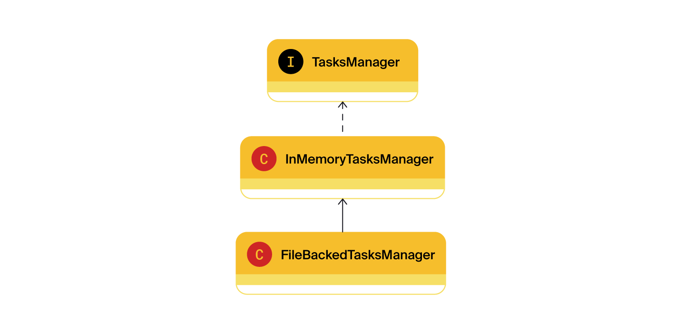

# Техническое задание

Текущая реализация хранит состояние менеджера в оперативной памяти, из-за этого после перезапуска приложения все нужные
нам данные теряются. Решить эту проблему может такой класс менеджера, который будет после каждой операции автоматически
сохранять все задачи и их состояние в специальный файл.

Вам предстоит создать вторую реализацию менеджера. У него будет такая же система классов и интерфейсов, как и у
нынешнего. Новый и старый менеджеры будут отличаться только деталями реализации методов: один хранит информацию в
оперативной памяти, другой — в файле.

## Вторая реализация менеджера

Итак, создайте класс `FileBackedTasksManager`. В нём вы будете прописывать логику автосохранения в файл. Этот класс, как
и
`InMemoryTasksManager`, должен имплементировать интерфейс менеджера `TasksManager`.


Теперь нужно написать реализацию для нового класса. Если у вас появится желание просто скопировать код из
`InMemoryTasksManager` и дополнить его в нужных местах функцией сохранения в файл, остановитесь! Старайтесь избегать
дублирования кода, это признак плохого стиля.

В данном случае есть более изящное решение: можно наследовать `FileBackedTasksManager` от `InMemoryTasksManager` и
получить
от класса-родителя желаемую логику работы менеджера. Останется только дописать в некоторых местах вызовы метода
автосохранения.



## Метод автосохранения

Пусть новый менеджер получает файл для автосохранения в своём конструкторе и сохраняет его в поле. Создайте метод `save`
без параметров — он будет сохранять текущее состояние менеджера в указанный файл.

Теперь достаточно переопределить каждую модифицирующую операцию таким образом, чтобы сначала выполнялась версия,
унаследованная от предка, а затем — метод `save`. Например:

```
@Override
public void addSubtask(Subtask subtask) {
    super.addSubtask(subtask);
    save();
}
```

Затем нужно продумать логику метода `save`. Что он должен сохранять? Все задачи, подзадачи, эпики и историю просмотра
любых задач. Для удобства работы рекомендуем выбрать текстовый формат CSV (англ. _Comma-Separated Values_, «значения,
разделённые запятыми»). Тогда файл с сохранёнными данными будет выглядеть так:

```
id,type,name,status,description,epic
1,TASK,Task1,NEW,Description task1,
2,EPIC,Epic2,DONE,Description epic2,
3,SUBTASK,Sub Task2,DONE,Description sub task3,2

2,3
```

Сначала через запятую перечисляются все поля задач. Ниже находится список задач, каждая из них записана с новой строки.
Дальше — пустая строка, которая отделяет задачи от истории просмотров. И заключительная строка — это идентификаторы
задач из истории просмотров.

Файл из нашего примера можно прочитать так: в трекер добавлены задача, эпик и подзадача. Эпик и подзадача просмотрены и
выполнены. Задача осталась в состоянии новой и не была просмотрена.

<details>
<summary>Как сохранять задачи в файл и считывать их из него</summary>

- Создайте enum с типами задач.
- Напишите метод сохранения задачи в строку `String toString(Task task)` или переопределите базовый.
- Напишите метод создания задачи из строки `Task fromString(String value)`.
- Напишите статические методы `static String historyToString(HistoryManager manager)` и `static List<Integer>
  historyFromString(String value)` для сохранения и восстановления менеджера истории из CSV.

</details>

<details>
<summary>Как прочитать файл</summary>

В Java есть несколько способов чтения файлов. Вы можете использовать такой:
```
Files.readString(Path.of(path));
```

</details>

## Проверка работы нового менеджера

Исключения вида `IOException` нужно отлавливать внутри метода `save` и кидать собственное непроверяемое
исключение `ManagerSaveException`. Благодаря этому можно не менять сигнатуру методов интерфейса менеджера.

💡 Мы исходим из того, что наш менеджер работает в идеальных условиях. Над ним не совершаются недопустимые операции, и
все его действия со средой (например, сохранение файла) завершаются успешно.

Помимо метода сохранения создайте статический метод `static FileBackedTasksManager loadFromFile(File file)`, который
будет
восстанавливать данные менеджера из файла при запуске программы. Не забудьте убедиться, что новый менеджер задач
работает так же, как предыдущий. И проверьте работу сохранения и восстановления менеджера из файла (сериализацию).

Для этого создайте метод `static void main(String[] args)` в классе `FileBackedTasksManager` и реализуйте небольшой
сценарий:

1. Заведите несколько разных задач, эпиков и подзадач.
2. Запросите некоторые из них, чтобы заполнилась история просмотра.
3. Создайте новый `FileBackedTasksManager` менеджер из этого же файла.
4. Проверьте, что история просмотра восстановилась верно и все задачи, эпики, подзадачи, которые были в старом, есть в
   новом менеджере.

## Итог

У вас должно появиться несколько новых классов, а также новый менеджер с опцией сохранения состояния. Убедитесь, что все
работает корректно
